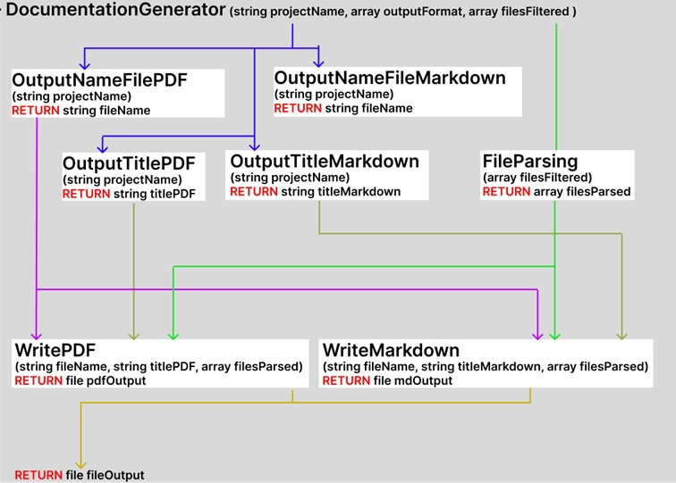
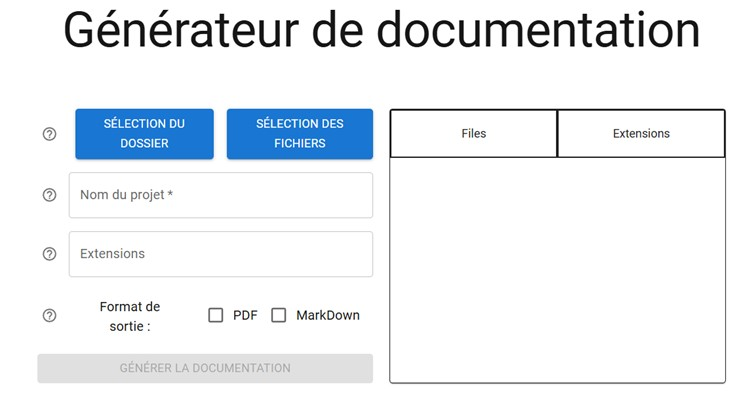
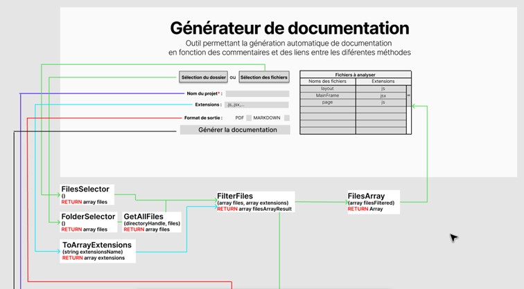
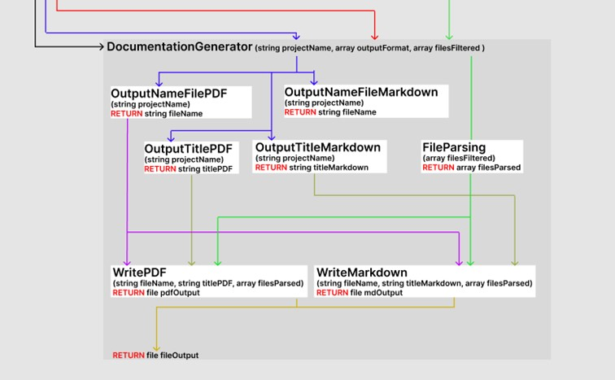

# Documentation Generator

[](https://github.com/thom-cr/documentation-generator/actions/workflows/node.js.yml)

[](https://codecov.io/gh/thom-cr/documentation-generator)

## Getting Started

First, run the development server:

```bash
npm run dev
```

Open [http://localhost:3000](http://localhost:3000) with your browser to see the result.

## Usage

The documentation generator extracts comments from the code to generate structured documentation in **PDF** or **Markdown** format.  

### Comment Format  

For a comment to be recognized and included in the documentation, it must follow one of these formats:  

- **Single-line comments:**  
  ```js
  //Doc: This function retrieves user data.
  // Doc: This function retrieves user data.
  //doc: This function retrieves user data.
  // doc: This function retrieves user data.
  ```  

- **Multi-line comments:**  
  ```js
  /*Doc: This function retrieves user data. */
  /* Doc: This function retrieves user data. */
  /*doc: This function retrieves user data. */
  /* doc: This function retrieves user data. */
  ```  

### Function Association  

To associate a comment with a specific function, it must be placed **immediately before the function declaration**. Example:  

```js
//Doc: This function retrieves user data from the database.
function getUserData() {
    // Function logic here
}
```

### Supported Projects  

Currently, this feature is only available for **JavaScript** projects. Support for additional languages may be added in future updates.

## Description
The automatic documentation generator is a tool that allows the creation and export of technical documentation in **PDF** or **Markdown** format for a project using the code and its comments with the help of **Jspdf** and **File-saver**.

## Technologies
- Node.js  
- Next.js  
- React  

### Required Libraries:
- File-saver  
- Jspdf  
- Jest  
- Mui  

## MVP Features
- Documentation generation based on comments.  
- Support for **REACT** and **JAVASCRIPT** files.  
- Selection of the project to document.  
- Storage and usage **ONLY** locally.  

## Features
- Display of detected file names.  
- Support for additional extensions.  
- Selection of file extensions to analyze.  
- Selection of output format (**PDF, MARKDOWN**).  

## MVP Components
- Documentation generation button (**ButtonGenerateDocumentation.jsx**)  
- File selection button (**ButtonFilesSelector.jsx**)  
- Folder selection button (**ButtonFolderSelector.jsx**)  
- Project name input field (**TextBoxProjectName.jsx**)  

### Additional Components
- Help button (**ButtonHelp.jsx**)  
- Output format checkbox (**CheckBoxOutputFormat.jsx**)  
- File table (**TableDetectedFiles.jsx**)  
- Extension input field (**TextBoxExtentions.jsx**)  

## MVP Functions
- Documentation generation (**DocumentationGenerator.js**)  
- File parsing (**FileParsing.js**)  
- File table (**FilesArray.js**)  
- File dictionary (**FilesArraySelection.js**)  
- File selection (**FilesSelector.js**)  
- File filtering (**FilterFiles.js**)  
- Folder selection (**FolderSelector.js**)  
- Markdown writing (**WriteMarkdown.js**)  
- PDF writing (**WritePDF.js**)  

### Additional Functions
- Recursive file capture (**GetAllFiles.js**)  
- PDF file name generator (**OutputNameFilePDF.js**)  
- Markdown file name generator (**OutputNameFileMarkdown.js**)  
- Markdown title generator (**OutputTitleMarkdown.js**)  
- PDF title generator (**OutputTitlePDF.js**)  
- Extension array transformation (**ToArrayExtensions.js**)  


## Components

### Documentation Generation Button
A button that generates the documentation using the **DocumentationGenerator** function. At least one file must be selected, the project must have a name, and at least one output format must be chosen.

### Folder Selection Button
A button that calls **FolderSelector, FilesArray,** and **FilesArraySelection** functions to select a folder from the disk and update the table.

### File Selection Button
A button that calls **FilesSelector, FilesArray,** and **FilesArraySelection** functions to select one or more files from the disk and update the table.

### Output Format Checkbox
Allows the selection of output format (**PDF** or **Markdown**) using two checkboxes. Updates the **formats dictionary** and the **boolean values** of the checkboxes.

### File Table
Displays the file names and extensions to verify the correct detection of all selected files.

### Project Name Input Field
Retrieves the project name from the text input field to update it in **formData**. The input is stored in the **projectName** variable.

### Extension Name Text Field
Retrieves the names of extensions to analyze and updates the **formData** and the file table.

### Help Button
A component that displays a button to help users understand how the generator works.


## Functions

### FolderSelector()
Allows selection of the folder to analyze using **showDirectoryPicker**. Uses the **GetAllFiles** function to recursively retrieve files from subfolders. Returns an **array of files** in **filehandle** format.

### FilesSelector()
Allows selection of one or more files to analyze using **showOpenFilePicker**. Returns an **array of files** in **filehandle** format.

### FilesArray(array files, string extensionsName)
Takes an array of files and an **extensions string** as input. The function converts the extensions into an array and returns a call to the **FilterFiles** function.

### FilterFiles(array files, array extensions)
Takes the **file array** and **extensions array** as input to return an array of files containing the targeted extensions using **ToArrayExtensions**.

### ToArrayExtensions(string extensionsName)
Takes extensions **separated by commas** as a string and converts them into an array.

### OutputNameFilePDF(string projectName)
Takes the **project name** as input to return the output file name with **.pdf**.

### OutputNameFileMarkdown(string projectName)
Takes the **project name** as input to return the output file name with **.md**.

### OutputTitlePDF(string projectName)
Takes the **project name** as input to rewrite it as the title at the beginning of the **PDF output** file using the **jspdf** library in the format **"Documentation of projectName"**.

### OutputTitleMarkdown(string projectName)
Takes the **project name** as input to rewrite it as the title at the beginning of the **Markdown output** file in the format **"# Documentation of projectName"**.

### OutputFormat(boolean checkboxPdf, boolean checkboxMd)
Takes the **PDF and Markdown checkbox booleans** as input to create a **dictionary (array)** that will be used in **DocGenerator**. It also checks that at least **one of the two checkboxes is checked**.

### FileParsing(formData, rows)
Takes all the **data and sorted rows** as input to analyze the extension and choose the correct syntax for extracting comments and function names. It also generates a **dictionary** with the **file name, function names, and associated comments**.

### WritePDF(string outputTitlePDF, string outputNameFilePDF, array filesParsed)
Takes the **title, PDF file name,** and **sorted file array** as input to generate the documentation in **PDF format**.

### WriteMarkdown(string outputTitleMarkdown, string outputNameFileMarkdown, array filesParsed)
Takes the **title, Markdown file name,** and **sorted file array** as input to generate the documentation in **Markdown format**.

### DocumentationGenerator(formData, rows)
Takes the **entire form data and sorted rows** as input to generate the output files by reusing the functions listed above (**FileParsing, OutputTitlePDF, OutputNameFilePDF, WritePDF, OutputTitleMarkdown, OutputNameFileMarkdown, WriteMarkdown**).



## Examples

Example documentation files generated by this project are available in the **examples** folder.
- 

## User Interface



## Scheme




## Coverage

[](https://codecov.io/gh/thom-cr/documentation-generator)